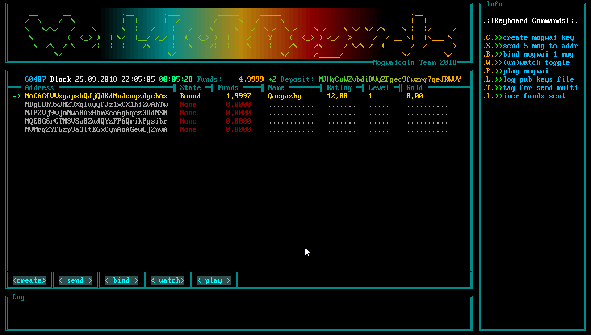
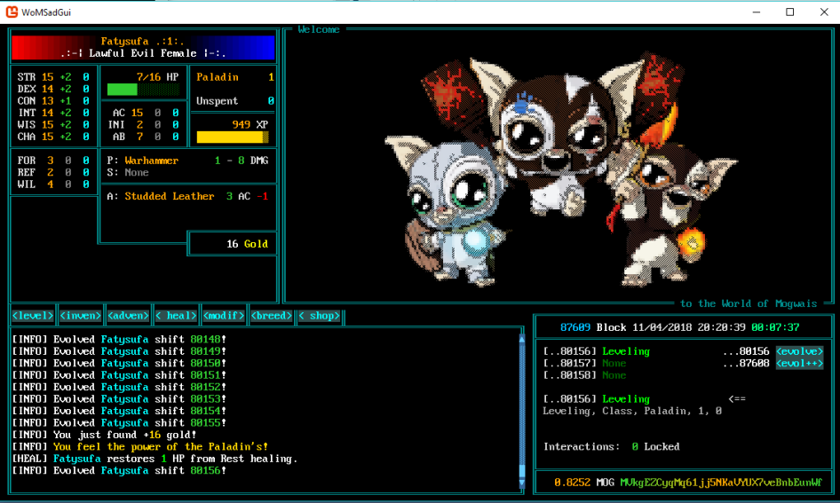
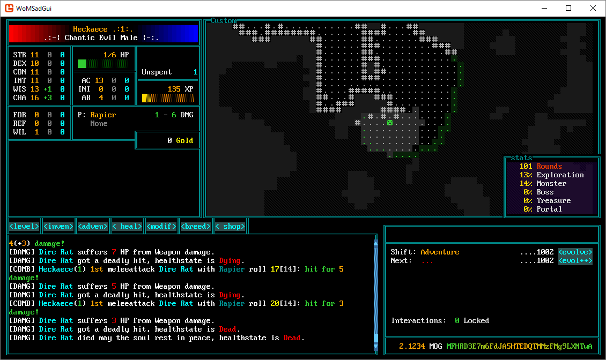

# WoMNetCore "World of Mogwais .NETCore"
[](https://ci.appveyor.com/project/darkfriend77/womnetcore)


## Introduction
World of Mogwais is a experiment driven by the idea of adding gamification to the blockchain technology. It builds up on the cryptocurrency Mogwai Coin.

## Getting Started
Make sure you have the [.NET Core SDK](https://www.microsoft.com/net/download) and git installed and run the following command.
```
git clone https://github.com/WorldOfMogwais/WoMNetCore.git
dotnet run --project ./WoMNetCore/WoMSadGui
```
When everything is successful and after you created or loaded a wallet you should see the Mogwai Selection Screen


After createing your first Mogwai you can proceed to the Play Screen


and if you feel ready send your mogwai to a dungeon.


## Tool
This tool is intended to help Dev's to test the gameframework and the wallet functionality.

## Story
In the mirror world of the Mogwais the downfall of the worlds has already began. An all-distorting darkness nourished by the vices of the worlds has taken over a large part of their living space.
Suppressed by the darkness, the mogwais transformed into evil and deceitful creatures.
In their viciousness they torment the souls of our ancestors on their last journey through the worlds.

But not all have succumbed to the evil force, still there are individuals who haven't been touched by the darkness.
Over a mystical cryptographical phenomenon an unknown relation was discovered.
Find a way to unite with the untouched mogwais to fight against evil darkness.

Book of Mogwai, Ch.8. "Bye bye, woof woof!"

## Mobile Version

We are currently working on the unity version of the game.
